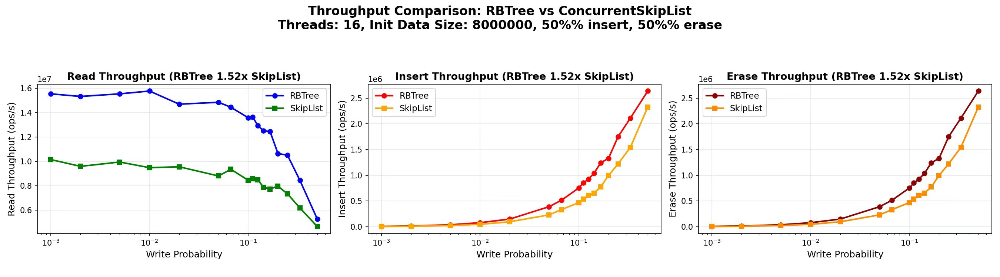
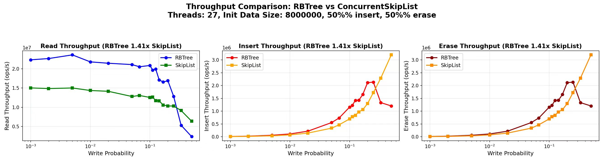
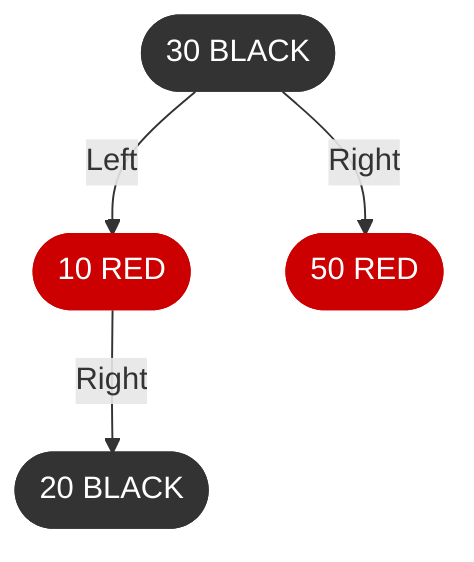

<div align="center">

  # ⚡ gipsy_danger::ConcurrentRBTree

  ### A Drop-In Replacement for folly::ConcurrentSkipList, Optimized for Read-Heavy Workloads

  [](LICENSE)
  [](https://en.cppreference.com/w/cpp/17)
  [](src/include/ConcurrentRBTree.h)
  [](#api-reference)

  **Up to 1.7x faster than folly::ConcurrentSkipList in read-heavy workloads**

</div>

<p align="center">
  
  <br/>
  <em>16 threads · 8M entries · <code>int32_t</code> · Intel i9-13900K</em>
  <br/>
  <a href="#-why-is-it-faster"><strong>Why?</strong></a> ·
  <a href="src/test/comparision_test/x86_result/"><strong>Full benchmark matrix (1 / 16 / 27 threads × 10⁵ / 10⁶ / 4·10⁶ / 8·10⁶ entries)</strong></a>
</p>

---

## 📖 Overview

**gipsy_danger::ConcurrentRBTree** is a high-performance, thread-safe sorted associative container that supports only unique keys (similar to `std::set` and `folly::ConcurrentSkipList`). It is specifically optimized for **large-scale read-intensive workloads** (especially when writes constitute **less than 20%** of operations), making it ideal for:

- **In-memory caching systems** (read-dominated workloads)
- **High-concurrency lookup tables**
- **Real-time indexing systems**
- **Server-side data structures** with read-dominated workloads

### 🎯 Key Features

- **Lock-free reads** – Multiple threads can read concurrently without blocking
- **Efficient range query support** – Iterator-based traversal with **linked-list-like performance** via internal linked list (no expensive inorder traversal)
- **Scales with data size** – Performance advantage over `folly::ConcurrentSkipList` increases at larger scales (millions of entries)
- **Weak consistency guarantees** – Identical to `folly::ConcurrentSkipList`: readers may see stale data but never corrupted state
- **Epoch-based garbage collection** – Memory-safe concurrent access pattern
- **Header-only library** – Easy integration, just include the header
- **STL-like API** – Familiar interface with `find`, `insert`, `erase`, `lower_bound`, iterators
- **Production-ready** – Comprehensive test suite including accuracy, leak detection, and performance benchmarks

---

## 🚀 Performance Benchmarks

All benchmarks were conducted on a high-performance system:

| **Specification** | **Detail** |
|-------------------|------------|
| **CPU** | Intel Core i9-13900K (16 cores, 32 threads) |
| **L1 Cache** | 48KB data + 32KB instruction per core |
| **L2 Cache** | 2MB per core |
| **L3 Cache** | 36MB shared |
| **Memory** | 62GB RAM |

### Test Methodology

- **All threads participate in both read and write operations** – Each thread can perform reads and writes concurrently
- **Write probability determines per-thread operation distribution** – Each thread independently follows the configured write probability
- **Balanced write operations** – For any write probability, `insert` and `erase` operations are evenly distributed (50% each)
- **Realistic data patterns** – 50% of `insert` operations target existing keys, 50% target new keys; same distribution for `erase` operations

### Scaling to 27 Threads (8M Initial Entries)

The hero chart above shows the 16-thread picture. Pushing concurrency to 27 threads (avoiding the 32-thread setting so as not to compete with OS / background processes) keeps the advantage intact — both implementations peak here, and <code>gipsy_danger::ConcurrentRBTree</code> still leads by **1.41× aggregate** and **~1.5× on reads**.

<p align="center">
  
</p>

### Key Results

At **10% write probability** (typical for production cache systems):

| **Metric** | **16 Threads** | **27 Threads** |
|------------|----------------|----------------|
| **Read Throughput** | ~1.6x faster | ~1.7x faster |
| **Write Throughput** | ~1.5x faster | ~1.6x faster |

Even at higher write probabilities, **gipsy_danger::ConcurrentRBTree** maintains a **1.4x – 1.5x** performance advantage on average.

---

## 🔍 Why Is It Faster?

### CPU Cache Analysis

<p align="center">
  
</p>

Despite `folly::ConcurrentSkipList` having slightly better cache hit rates (due to smaller node sizes), **gipsy_danger::ConcurrentRBTree** achieves superior overall performance because:

1. **Fewer data accesses** – ~50% reduction in total data access count
2. **Fewer CPU instructions** – ~50% reduction in instruction execution count

From this, it can be seen that although both have a time complexity of **O(log n)**, the constant factor of the Red-Black Tree is nearly just **1/2** that of the Skip List.

---

## ⚖️ Design Trade-offs

As the saying goes, *"There's no such thing as a free lunch."* `gipsy_danger::ConcurrentRBTree`'s performance comes with intentional trade-offs:

### 1. Partial Write Serialization

Write operations use a **two-phase design** to maximize concurrency:

- **Phase 1 (Lock-free)**: Each write thread independently traverses the tree to find an estimated insertion/deletion position — this phase runs fully concurrently with no synchronization overhead.
- **Phase 2 (Serialized)**: Only the structural modification (linked-list update, tree node attachment, and rebalancing) is serialized via a lightweight spinlock.

This design choice:

- ✅ **Allows concurrent write threads to overlap their search phases**
- ✅ **Eliminates complex fine-grained locking** for tree rotations
- ✅ **Delivers exceptional read performance** in read-intensive scenarios
- ⚠️ **Structural modifications are still serialized**, so write-heavy workloads (write operations > ~20%) may bottleneck on the spinlock

For cache workloads where reads dominate, this trade-off is highly favorable.

### 2. Memory Overhead

**gipsy_danger::ConcurrentRBTree** nodes are approximately **30% larger** than `folly::ConcurrentSkipList` nodes (measured with 1M entries of 4-byte values). This results in:

- ⚠️ **Slightly lower cache hit rates**
- ✅ **Negligible impact** as value size increases (node overhead becomes less significant)

---

## 📦 Usage

### Installation

**gipsy_danger::ConcurrentRBTree** is a **header-only** library. Simply include the header in your project:

```cpp
#include <ConcurrentRBTree.h>
```

Compile with the include path:

```bash
g++ -std=c++17 -I/path/to/rbtree_impl/src/include your_code.cpp -o your_program
```

### Disable Debug Mode

For production builds, disable assertions for optimal performance:

```bash
g++ -std=c++17 -DNDEBUG -I/path/to/rbtree_impl/src/include your_code.cpp -o your_program
```

### API Reference

The API follows `folly::ConcurrentSkipList` conventions:

```cpp
#include <ConcurrentRBTree.h>
#include <iostream>

using namespace gipsy_danger;

int main() {
    // Create a ConcurrentRBTree instance
    auto rbtree = ConcurrentRBTree<int>::createInstance();

    // Access the tree through an Accessor (similar to folly's pattern)
    ConcurrentRBTree<int>::Accessor accessor(rbtree);

    // Insert elements
    accessor.insert(42);
    accessor.insert(10);
    accessor.insert(100);

    // Find elements
    auto it = accessor.find(42);
    if (it != accessor.end()) {
        std::cout << "Found: " << *it << std::endl;
    }

    // Range query using iterator
    std::cout << "All elements: ";
    for (auto it = accessor.begin(); it != accessor.end(); ++it) {
        std::cout << *it << " ";
    }
    std::cout << std::endl;

    // Lower bound search
    auto lb = accessor.lower_bound(50);
    std::cout << "Lower bound of 50: " << (lb != accessor.end() ? *lb : -1) << std::endl;

    // Erase elements
    size_t erased = accessor.erase(10);
    std::cout << "Erased " << erased << " element(s)" << std::endl;

    // Check size
    std::cout << "Size: " << accessor.size() << std::endl;

    return 0;
}
```

### Thread Safety

- **✅ Thread-safe reads**: Multiple threads can read concurrently
- **✅ Thread-safe writes**: Multiple threads can write concurrently (search phase is lock-free, only structural modifications are serialized)
- **✅ Thread-safe mixed operations**: Reads and writes can occur simultaneously

### Consistency Guarantees

`gipsy_danger::ConcurrentRBTree` provides **weak consistency guarantees**, identical to `folly::ConcurrentSkipList`:

- Readers may observe stale data but will never see corrupted state
- Writes become visible to all threads atomically
- No guarantees on immediate visibility across threads
- Iterators remain valid during concurrent modifications (may reflect stale or updated state)

---

## 📊 More Benchmark Data

For comprehensive test results covering different thread counts and initial data sizes, visit our benchmark results directory:

[📁 **x86_result** - Complete Benchmark Results](src/test/comparision_test/x86_result/)

---

## 🏗️ Architecture

`gipsy_danger::ConcurrentRBTree` maintains a **dual-index structure**: a red-black tree for O(log n) search and an **internal sorted linked list** that threads through all data nodes in order. This dual structure is the key to achieving lock-free reads alongside concurrent writes.

### Dual-Index Design

**Red-Black Tree — O(log n) Lookup**



**Sorted Linked List — Ground Truth**


- The **red-black tree** provides fast O(log n) positioning, but its structure may be temporarily inconsistent during write-side rotations.
- The **sorted linked list** (connected via atomic `next_` pointers) serves as the authoritative ordered view — readers fall back to it when tree traversal is disrupted by concurrent modifications.

### Read Path (Lock-Free)

1. Traverse the red-black tree to locate an approximate position (`less_bound`)
2. Walk forward along the sorted linked list (up to 3 steps) to find the exact target
3. If the linked-list walk fails (due to a concurrent rotation disrupting the tree search), retry from the tree root

Readers never acquire any lock. The sorted linked list guarantees that even if a tree rotation produces an inconsistent search path, the reader can self-correct.

### Write Path (Two-Phase)

1. **Phase 1 — Lock-free search**: Traverse the tree to find an `estimated_less_bound` — this runs concurrently with other reads and writes, no synchronization needed.
2. **Phase 2 — Serialized modification**: Acquire a lightweight spinlock (`atomic_flag`), then:
   - Refine the position via the sorted linked list (`exact_less_bound`)
   - Update the linked list (atomic `next_` pointer swap)
   - Attach/detach the node in the red-black tree and rebalance
   - Toggle the node's `accessible_` flag to control visibility to readers

### Node Visibility Protocol

Each node carries an `atomic<bool> accessible_` flag (acquire/release semantics):
- **Insert**: The node is fully wired into both the linked list and the tree **before** `accessible_` is set to `true`
- **Erase**: `accessible_` is set to `false` **before** the node is detached from either structure

This ensures readers never observe a half-constructed or half-removed node.

### Epoch-Based Garbage Collection

Erased nodes cannot be freed immediately — concurrent readers may still hold references. An **epoch-based recycler** (inspired by `folly::ConcurrentSkipList::NodeRecycler`) collects erased nodes and batch-deletes them only when all active `Accessor` instances (which act as epoch guards) have been released.

---

## 🧪 Testing

The project includes comprehensive test coverage:

### Accuracy Tests
- Single-threaded functionality verification
- Concurrent operation correctness
- Edge case handling
- Type system validation

### Performance Tests
- Comparison with `folly::ConcurrentSkipList`
- Multi-threaded scalability analysis
- CPU profiling and cache analysis

### Leak Detection
- Memory leak verification under concurrent workloads

Build tests:

```bash
cd src/test
make
```

---

## 📝 Notes

- **const_iterator** – Currently not supported (use regular `iterator`)
- **Custom comparators** – Not yet supported (can be achieved through custom value type wrappers)

---

## 🤝 Contributing

Contributions are welcome! Please feel free to submit issues or pull requests.

---

## 📄 License

This project is open source and available under the [MIT License](LICENSE).

---

<div align="center">

  **Built with ❤️ for high-performance concurrent systems**

</div>
